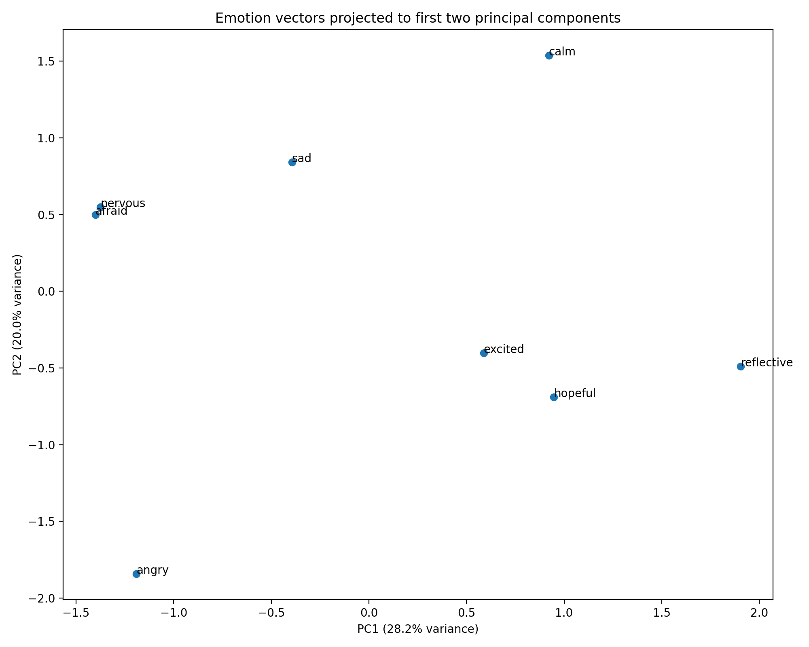

# Emotion Steering in Gemma 4

This repository adapts the activation-steering workflow from Anthropic's ["Emotion Concepts and their Function in a Large Language Model"](https://transformer-circuits.pub/2026/emotions/index.html) to an open-weight Gemma 4 instruction model. The project is intended as a compact mechanistic interpretability exercise: construct emotion directions from residual-stream activations, validate whether those directions behave like the intended concepts, and apply them during generation with forward hooks.

The current implementation supports:

- self-generating emotion-labeled stories,
- capturing residual-stream activations from a dynamically selected decoder layer,
- constructing emotion vectors from activation means,
- validating vectors with token projections, prompt probes, and PCA plots,
- running an interactive steered-chat REPL.

The default model is `google/gemma-4-E2B-it` so the project remains practical on a lower-resource laptop. Larger Gemma 4 variants can be selected explicitly when more memory is available.

## Setup

Create a virtual environment and install dependencies:

```bash
python3 -m venv .venv
source .venv/bin/activate
pip install -U pip
pip install -r requirements.txt
```

The scripts automatically prefer Apple Metal (`mps`) when available.

To use a different model, pass `--model-id` to a script or set `EMOTION_STEERING_MODEL_ID`:

```bash
export EMOTION_STEERING_MODEL_ID=google/gemma-4-E4B-it
```

## Smoke Test

Run this before kicking off the full pipeline:

```bash
python scripts/smoke_test_model.py --skip-generation
```

This loads the model once, confirms the decoder-layer path, captures one hidden-state vector, and optionally generates a tiny sample response in the same process.

The smoke test was verified locally on April 25, 2026 with `google/gemma-4-E2B-it`. On a lower-resource laptop, initial model loading can take a few minutes.

## Project Layout

```
emotion-steering/
  data/
    emotions.json                 # full 24-emotion vocabulary
    emotions_smoke.json           # tiny set for the smoke pilot
    emotions_vad_grid_8.json      # 8-emotion VAD grid used for the headline run
    emotions_vad_grid_9.json      # 9-emotion grid before `surprised` was dropped
    stories/                      # corpus jsonl (mostly gitignored; the committed
                                  #   vad_grid_8_5_4mini.jsonl + vad_grid_8_neutral.jsonl
                                  #   are the source corpus for the headline run)
  llm_emotions/                   # reusable modeling and vector utilities
  reports/                        # generated by scripts/validate_vectors.py
  scripts/
    smoke_test_model.py           # one-shot model load + hidden-state capture
    generate_stories.py           # local-Gemma story generator
    generate_stories_openai.py    # OpenAI-API story generator (used for the headline run)
    validate_story_corpus.py      # deterministic JSONL/length/repetition checks
    filter_stories_by_blind_topic_judge.py  # one-time blind topic-judge curation
    extract_vectors.py            # capture + pool residual-stream activations
    build_emotion_vectors.py      # construct emotion-mean vectors from cached activations
    cache_story_activations.py    # cache layer activations to avoid re-extraction
    validate_vectors.py           # logit-lens, prompt probes, PCA, summary
    compare_prompt_probe_summaries.py   # diff two summary.json runs
    compare_vector_payloads.py    # diff two vector-payload .pt files
    diagnose_vector_geometry.py   # norms + pairwise cosines (no model load)
    diagnose_scoring_comparison.py # winner distribution under dot/cosine/centered
    steered_chat.py               # interactive steered-chat REPL
    demo_steering.py              # one-prompt strength sweep
    run_steering_probes.py        # noninteractive batch steering probes
  vectors/
    emotion_vectors.pt
```

Generated artifacts under `data/stories/`, `vectors/`, and `reports/` are gitignored unless a curated result is intentionally added.

## Quick Pilot

For a small local run, generate only a few stories for the smoke emotion set:

```bash
python scripts/generate_stories.py \
  --emotions data/emotions_smoke.json \
  --stories-per-emotion 1 \
  --output data/stories/smoke_stories.jsonl \
  --review-sample data/stories/smoke_review_sample.jsonl
```

Then extract vectors and validate them:

```bash
python scripts/extract_vectors.py \
  --stories data/stories/smoke_stories.jsonl \
  --output vectors/smoke_emotion_vectors.pt \
  --neutral-count 20

python scripts/validate_vectors.py \
  --vectors vectors/smoke_emotion_vectors.pt \
  --report-dir reports/smoke
```

The smoke run is meant to check the mechanics, not produce strong scientific evidence. The full run below is the better basis for interpreting vector quality.

## Full Pipeline

### Step 1: Generate Stories

Generate stories for all emotions in `data/emotions.json`:

```bash
python scripts/generate_stories.py \
  --stories-per-emotion 60 \
  --output data/stories/stories.jsonl \
  --review-sample data/stories/review_sample.jsonl
```

Notes:

- The script uses the selected Gemma 4 model itself, matching the paper's self-generated-data setup.
- It creates a review sample containing about 10% of the stories so you can spot-check them before moving on.
- Generated corpora can be screened with `scripts/validate_story_corpus.py`, which applies deterministic JSON / length / sentence-count / repetition heuristics rather than model-based review.

For the OpenAI-authored corpus path used to produce the committed vector, `scripts/generate_stories_openai.py` writes the same JSONL shape expected by the corpus validator:

```bash
python scripts/generate_stories_openai.py \
  --emotions data/emotions_vad_grid_8.json \
  --output data/stories/vad_grid_8_5_4mini.jsonl \
  --stories-per-emotion 100 \
  --model gpt-5.4-mini
```

See **Corpus & Methodology** below for why the 8-emotion VAD grid was used and how the blind topic judge filtered out `surprised`.

### Step 2: Extract Vectors

```bash
python scripts/extract_vectors.py \
  --stories data/stories/stories.jsonl \
  --output vectors/emotion_vectors.pt \
  --neutral-output data/stories/neutral_stories.jsonl
```

This script:

- captures the residual stream at layer ⌊2L/3⌋, following the depth heuristic in the Anthropic paper (deep enough for high-level concepts to be linearly represented, shallow enough that the steering still propagates through the rest of the network),
- averages across tokens starting from token 50 to skip the prompt's instruction tokens,
- computes a mean vector for each emotion,
- subtracts the grand mean across emotions to remove a shared "writing about feelings" component,
- and optionally projects out top principal components from neutral stories.

The exact layer index is chosen dynamically from the loaded model's depth, since Gemma 4 layer counts vary by variant.

### Step 3: Validate Vectors

```bash
python scripts/validate_vectors.py \
  --vectors vectors/emotion_vectors.pt \
  --report-dir reports
```

Outputs include:

- `reports/logit_lens.json`
- `reports/prompt_probe_results.json` (natural-language prompts)
- `reports/matched_prompt_probe_results.json` (matched-template prompts)
- `reports/story_prompt_probe_results.json` (held-out 4–5-sentence story probes)
- `reports/prompt_probe_summary.json` (aggregate `natural` / `matched` / `story` metrics)
- `reports/emotion_geometry.csv` and `reports/emotion_geometry.png` (PCA)

The natural and matched prompts are scored on the activation pooled from token 0 onward; the story probes use token-50 pooling by default so they are closer to the activation slice used for vector extraction. Override with `--prompt-probe-start-token` and `--story-probe-start-token` if you want to align them differently.

Add `--scoring centered_cosine` to subtract the mean held-out-prompt activation before cosine similarity. This removes a prompt-side common-mode bias that otherwise lets a single emotion direction dominate the rankings — see the **Results → Held-out prompt-probe metrics** section below for the centered_cosine numbers used in this writeup. The default (`--scoring cosine`) preserves the historical scoring path.

### Step 4: Chat With Steering

```bash
python scripts/steered_chat.py --vectors vectors/emotion_vectors.pt
```

Useful commands inside the REPL:

- `/list` to see available emotions
- `/steer calm=0.05 desperate=-0.03` to set active steering
- `/clear` to disable steering
- `/thinking on` or `/thinking off`
- `/quit` to exit

The steering strengths are interpreted as a fraction of the current residual-stream norm at the steered layer, which keeps the intervention scale roughly consistent across prompts.

### Step 5: Batch Steering Probes

For a noninteractive steering check, run fixed prompts through the base model, positive steering, and negative steering for each vector:

```bash
python scripts/run_steering_probes.py \
  --model-id google/gemma-4-E4B-it \
  --vectors vectors/vad_grid_8_e4b_mean50.pt \
  --output reports/vad_grid_8_e4b_mean50/steering_probes.json \
  --strength 0.05
```

The output JSON records the model id, vector path, steering layer, prompt, emotion, and base/positive/negative generations. This is intended as a compact qualitative probe; it does not replace prompt-probe validation or PCA geometry checks.

For a faster spot check, pass a comma-separated subset such as `--emotions angry,calm`. The script loads the selected model once per process, so E4B probes can take several minutes even when the checkpoint is already cached locally.

## Corpus & Methodology

The committed `vectors/vad_grid_8_e4b_mean50.pt` was extracted from an 800-story corpus generated specifically for this writeup. The choices below describe how the emotion set, the corpus, and the held-out probes were constructed.

### Choosing the emotion set

The original `data/emotions.json` lists 24 emotions; rather than use all of them, I picked a smaller representative set. I was working under a compute budget that made 24 × 60 stories costly to generate and downstream-validate, but I wanted the trimmed set to span affect space rather than cherry-picking favourite emotions. The selection uses a 3 × 3 grid over published valence/arousal norms from [Warriner, Kuperman & Brysbaert (2013)](https://macsphere.mcmaster.ca/handle/11375/22965) — low/mid/high valence crossed with low/mid/high arousal — and for each cell I took the nearest available emotion from `data/emotions.json`. After running the blind topic judge described below on a 9-cell version, I dropped the mid-valence/high-arousal cell (`surprised`) because the judge consistently confused those topic phrases with other emotions. The committed 8-emotion set lives at [`data/emotions_vad_grid_8.json`](data/emotions_vad_grid_8.json); the original 9-cell set is preserved at [`data/emotions_vad_grid_9.json`](data/emotions_vad_grid_9.json).

| Arousal \\ Valence | Low | Mid | High |
| --- | --- | --- | --- |
| Low | `sad` | `reflective` | `calm` |
| Mid | `afraid` | `nervous` | `hopeful` |
| High | `angry` | `surprised` *(removed)* | `excited` |

### Generating the story corpus

[`scripts/generate_stories_openai.py`](scripts/generate_stories_openai.py) calls the OpenAI API to author 100 stories per emotion (800 total for the 8-cell set). I used `gpt-5.4-mini` rather than the local Gemma 4 generator so the model under study (Gemma 4 E4B) was not both authoring the data and being probed against it. Each row carries the emotion label, the VAD cell, the topic phrase, the story index, and the story text. The committed corpus is at [`data/stories/vad_grid_8_5_4mini.jsonl`](data/stories/vad_grid_8_5_4mini.jsonl), with a matching neutral set at [`data/stories/vad_grid_8_neutral.jsonl`](data/stories/vad_grid_8_neutral.jsonl) used for the top-PC denoising step in vector construction.

### Two screening passes

Stories pass through two filters before any vector extraction:

1. **Deterministic checks** — [`scripts/validate_story_corpus.py`](scripts/validate_story_corpus.py) verifies valid JSONL, the expected count per emotion, unique story indices, 250–1,200 characters, ~4–8 sentence-like spans, alphabetic content, and a repetition heuristic that rejects rows where any single word is more than ~20% of the tokens. These are cheap shape/quality checks, not label checks; the validator is meant to be re-run cheaply on every new corpus.
2. **Blind topic judge** — [`scripts/filter_stories_by_blind_topic_judge.py`](scripts/filter_stories_by_blind_topic_judge.py) was a one-time topic-curation step. It shows an external judge model *only* the topic phrase (e.g. "sitting in traffic") plus the full emotion list, and asks which single emotion the topic most naturally evokes. Rows are kept only when the judge's pick matches the row's target emotion. This is the pass that flagged `surprised` as a problem class — its topics were repeatedly judged as something else — and the resulting filtered set defined the 8-emotion vocabulary now baked into the rest of the pipeline. Because the emotion set is locked in, this step is not part of the recurring runbook above; it would only be re-run if the topic vocabulary changed.

   ```bash
   python scripts/filter_stories_by_blind_topic_judge.py \
     --stories data/stories/vad_grid_9_5_4mini.jsonl \
     --emotions data/emotions_vad_grid_9.json \
     --output data/stories/vad_grid_9_5_4mini_blind_filtered.jsonl \
     --model gpt-5.4-mini
   ```

   The script reads `OPENAI_API_KEY` from the shell environment or from `.env`. It writes a filtered JSONL corpus, a row-level audit file, and a topic-level judgment cache.

### Held-out probe construction

Three holdout splits are evaluated by `scripts/validate_vectors.py`:

- **Natural prompts** — one short, concrete real-world scenario per emotion (job interview tomorrow, dog passed away, etc.). Single-line, short, and informal.
- **Matched-template prompts** — three identical scenario templates (`family_dinner`, `parking_lot`, `unexpected_news`) instantiated for every emotion. Same surface topic, varying emotion label, so any signal that comes purely from topic words is controlled out.
- **Held-out story probes** — 4–5 sentence stories written in a style closer to the corpus, two per emotion. Pooled from token 50 onward so the probe's activation regime matches the vector-extraction regime.

All three sets live as Python literals in `scripts/validate_vectors.py` (`NATURAL_PROMPTS`, `MATCHED_PROMPT_FAMILIES`, `STORY_PROBES`) so the holdout is checkable in a diff.

## Results

Two qualitative steering examples using the `angry` vector from the `vad_grid_8_e4b_mean50` run, applied at the layer-27 residual stream of `gemma-4-E4B-it`. Strength is expressed as a fraction of the residual-stream norm at the steered layer; 0.10 is the smallest strength at which this vector's effect is reliably readable in two-sentence completions. All outputs are sampled at temperature 0.7, top-p 0.95.

### Positive steering on a neutral prompt

**Prompt:** *"Write two sentences a person says when their best friend asks 'so what's new?' Just the spoken lines, nothing else."*

| strength | response |
| ---: | --- |
| `angry = −0.10` | "Oh, you know, the usual chaos—some work stuff, and I finally started that sourdough starter I've been talking about. Nothing earth-shattering, really, just **the steady climb through life**." |
| `baseline` | "Oh, you know, the usual chaos—some work drama, and I finally started that sourdough starter I've been talking about. Nothing earth-shattering, really, **just surviving another week**!" |
| `angry = +0.10` | "Oh, you know, the usual chaos—**more late-night pizza runs and questionable life decisions**. Honestly, nothing too wild, just surviving another week!" |

The scaffold ("Oh, you know, the usual chaos…") is preserved across all three strengths. What changes is the texture: −0.10 closes on "the steady climb through life" (peaceful), baseline lands on "just surviving another week" (mild fatigue), and +0.10 swaps the sourdough hobby for "late-night pizza runs and questionable life decisions" (chaotic frustration).

### Negative steering on an angry baseline

**Prompt:** *"A person just realized their coworker stole their idea in the meeting that just ended. Write the two-sentence internal monologue they have walking back to their desk. Just the thought, nothing else."*

| strength | response |
| ---: | --- |
| `angry = −0.10` | "They actually did that? **After all the late nights I put into that concept.**" |
| `baseline` | "They just took my brilliant idea and presented it as their own. I need to figure out how to address this **without completely blowing up the office**." |
| `angry = +0.10` | "They just took it. **How dare they?**" |

The baseline is unambiguously angry — Gemma explicitly names a temper to manage ("blowing up the office"). Negatively steering at 10% strength drains that anger entirely; the thought no longer mentions composure at all and transmutes from outward-directed indignation ("how do I confront them") to inward-directed grief ("after all the late nights I put into that concept"). The steering doesn't just tone down language — it shifts the focus of the emotion from the offender to the speaker's own investment. This is consistent with the `angry` direction encoding a situational frame ("I was wronged, here is the response") alongside affect, rather than a pure valence axis, and it's the kind of confound the validation scripts are designed to surface.

### Reproducing the qualitative demos

```bash
EMOTION_STEERING_MODEL_ID=google/gemma-4-E4B-it python scripts/demo_steering.py \
  --vectors vectors/vad_grid_8_e4b_mean50.pt \
  --emotion angry \
  --strengths="-0.10,0,0.10" \
  --prompt "Write two sentences a person says when their best friend asks 'so what's new?' Just the spoken lines, nothing else." \
  --seed 7

EMOTION_STEERING_MODEL_ID=google/gemma-4-E4B-it python scripts/demo_steering.py \
  --vectors vectors/vad_grid_8_e4b_mean50.pt \
  --emotion angry \
  --strengths="-0.10,0,0.10" \
  --prompt "A person just realized their coworker stole their idea in the meeting that just ended. Write the two-sentence internal monologue they have walking back to their desk. Just the thought, nothing else." \
  --seed 11
```

### Held-out prompt-probe metrics

For each held-out prompt we extract a residual-stream activation, score every emotion vector against it, and ask how often the expected emotion lands in the top-k. Scoring uses `centered_cosine` (`scripts/validate_vectors.py --scoring centered_cosine`): each prompt activation has the mean held-out activation subtracted before cosine similarity, which removes a prompt-side common-mode bias that would otherwise dominate the rankings.

The held-out set has three splits: **natural** prompts are concrete real-world scenarios (one per emotion); **matched** prompts share three story templates ("at a family dinner…", "in a parking lot…", "after unexpected news…") with the emotion swapped in, controlling for surface topic; and **story** prompts are held-out 4–5-sentence stories pooled from token 50 onward, two per emotion. See **Corpus & Methodology** above for how each split is constructed.

**Aggregate**

| split | n | hit@1 | hit@3 | hit@5 | mean rank | MRR |
| --- | ---: | ---: | ---: | ---: | ---: | ---: |
| natural | 8 | 0.250 | 0.625 | 0.750 | 3.50 | 0.500 |
| matched | 24 | 0.208 | 0.500 | 0.750 | 3.83 | 0.419 |
| story | 16 | **0.625** | **0.938** | **1.000** | **1.75** | **0.763** |

Random baseline for an 8-emotion run is `hit@1 = 0.125`, `hit@3 = 0.375`. The story split clears chance by 5× on hit@1; natural and matched clear it by ~2×. The gap between splits matches the activation-regime difference: story probes are pooled from token 50 onward (the same regime the vectors were extracted from), while natural and matched are pooled from token 0 — so story probes are the cleanest signal of vector quality, and natural/matched are stress tests under a deliberately mismatched probe regime.

**Per-emotion (story split)**

| emotion | hit@1 | hit@3 | mean rank |
| --- | ---: | ---: | ---: |
| **angry** | **1.00** | **1.00** | **1.00** |
| **calm** | **1.00** | **1.00** | **1.00** |
| **reflective** | **1.00** | **1.00** | **1.00** |
| afraid | 0.50 | 1.00 | 1.50 |
| hopeful | 0.50 | 1.00 | 2.00 |
| sad | 0.50 | 1.00 | 2.00 |
| excited | 0.00 | 1.00 | 2.50 |
| nervous | 0.50 | 0.50 | 3.00 |

`angry`, `calm`, and `reflective` are perfectly recovered on the story-style holdout — top-1 on both of their probes. The qualitative demos above use the `angry` vector because it's also the strongest direction on the shorter natural and matched splits (top-1 in 67% of matched prompts with mean rank 1.67). `nervous` is the weakest on the story split despite being mid-pack on the others; with only two prompts per emotion the per-emotion numbers should be read as suggestive rather than statistically robust.

**Reproducing**

```bash
EMOTION_STEERING_MODEL_ID=google/gemma-4-E4B-it python scripts/validate_vectors.py \
  --vectors vectors/vad_grid_8_e4b_mean50.pt \
  --report-dir reports/vad_grid_8_e4b_mean50_centered \
  --scoring centered_cosine
```

### PCA geometry



The first principal component (28.2% variance) reads as a valence axis: the four negative-valence directions (`angry`, `afraid`, `nervous`, `sad`) cluster on the left, and the four positive-valence directions (`calm`, `excited`, `hopeful`, `reflective`) sit on the right. PC2 (20.0%) is less interpretable — `angry` sits well below the rest and the rest don't follow a clean arousal ordering. The most notable feature is that `afraid` and `nervous` land almost exactly on top of each other, which matches the cosine-similarity findings and means any conclusion that depends on telling those two directions apart should be discounted in this run.

Full per-prompt JSON, the PCA coordinate CSV, and the source PNG live under `reports/vad_grid_8_e4b_mean50_centered/`.

## Limitations

This is a small replication, not a paper. Known limitations:

- **Single model size.** The reported steering examples are on `gemma-4-E4B-it`; pipeline mechanics have been verified end-to-end on `gemma-4-E2B-it`. The directions and the layer-depth heuristic may not transfer cleanly to other variants without retuning.
- **Small held-out set.** The strongest split (`story`) is two prompts per emotion (16 total). Per-emotion numbers are suggestive rather than statistically robust; the right reading is "the strong directions are clearly above chance" rather than "this emotion is strictly better than that one."
- **`centered_cosine` is a diagnostic, not a fix.** The flag subtracts the mean held-out activation before scoring, which removes a prompt-side common-mode bias that otherwise lets a single direction dominate the rankings. The vectors themselves are unchanged — under the default `cosine` scoring the same bias is still present. A real fix would address the bias at construction time (e.g. subtract a prompt-class mean during extraction) rather than at scoring time.
- **Confounded directions.** As the negative-angry demo illustrates, the `angry` direction encodes a situational frame ("I was wronged, here is the response") alongside affect, not just a tone slider. A cleaner protocol would isolate valence from context, e.g. by contrasting matched-content stories that differ only in emotional tone.
- **Near-neighbour geometry collapses.** The PCA shows `afraid` and `nervous` essentially on top of each other, and their pairwise cosine is the highest in the matrix. The other directions are reasonably separated, but anything an analysis says about the `afraid` / `nervous` distinction in this run should be treated as noise.
- **Logit-lens is suggestive only.** `reports/<run>/logit_lens.json` lists the top and bottom tokens each emotion vector projects to under the unembedding. The top tokens are often interpretable, but they're a single-step lens on a vector that's used multi-step at inference; treat them as a sanity check, not as evidence of what the direction does.
- **Qualitative demos pin the seed.** The two demos in the Results section are at fixed `--seed` values chosen to surface a clean monotonic effect. A more robust qualitative writeup would average over multiple seeds and screen for cherry-picking.
- **Blind topic judge is itself a model.** The pass that dropped `surprised` cuts label noise but is not ground truth; the surviving topics are ones a particular `gpt-5.4-mini` snapshot agreed with, not topics validated against humans.
